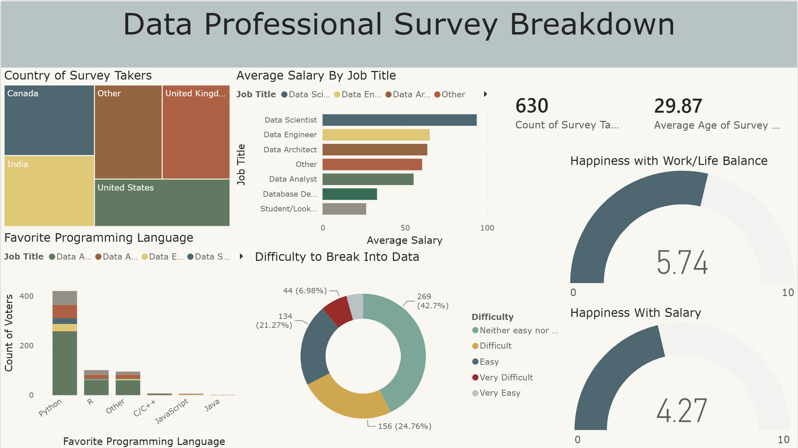

# Data Professional Survey Dashboard

An interactive Power BI dashboard analyzing survey data from **630 data professionals** to explore career trends, salary insights, programming language preferences, and overall satisfaction within the data field.

## Dashboard Preview

## Key Insights

- Survey includes 630 data professionals.
- Average participant age is approximately 29.9 years.
- Salary comparisons across different data-related job titles.
- Programming language preferences across different roles.
- Analysis of how difficult participants found entering the data field.
- Work-life balance satisfaction analysis.
- Salary satisfaction analysis.
- Geographic distribution of survey participants.

## Dashboard Features

- Salary analysis by job title
- Programming language preference analysis
- Career-entry difficulty breakdown
- Work-life balance and salary satisfaction indicators
- Country distribution of survey participants
- Interactive Power BI visualizations

## Tools

- Microsoft Power BI
- Data visualization
- Data analysis

## Project Files

The repository includes the original Power BI `.pbix` file for exploring the dashboard and its interactive visualizations.
